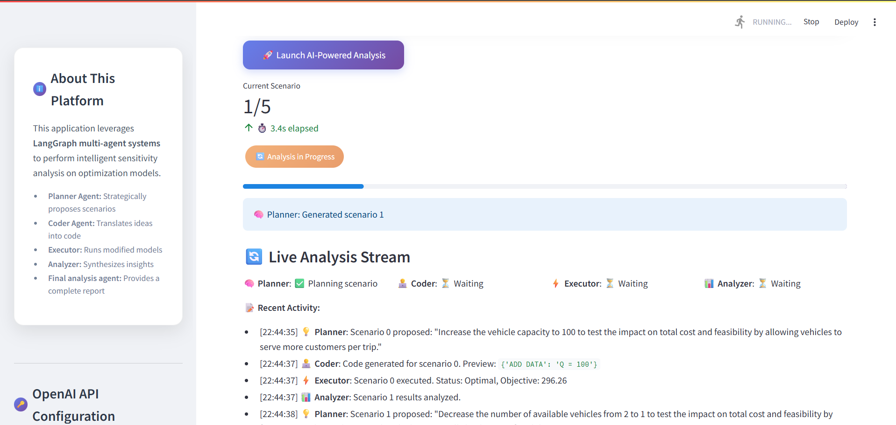

# Multi-Agent Supply Chain Optimization Sensitivity Analysis

This project implements an AI-powered framework for automated sensitivity analysis in supply chain optimization models. It leverages a multi-agent system built with LangGraph to intelligently explore various scenarios, modify optimization models, execute them, and analyze the results.

## Project Overview

The core idea is to automate the traditionally manual and time-consuming process of sensitivity analysis. By using specialized AI agents (Planner, Coder, Executor, Analyzer), the system can:

-   **Intelligently propose scenarios**: The Planner agent identifies critical parameters and suggests impactful changes.
-   **Dynamically modify models**: The Coder agent translates natural language scenarios into executable code modifications for the optimization model.
-   **Execute and capture results**: The Executor safely runs the modified models and records performance metrics.
-   **Synthesize insights**: The Analyzer agent processes the results to provide a comprehensive summary of sensitivities and key findings.

This framework aims to enhance the efficiency and quality of sensitivity analysis, making it a more accessible and powerful tool for supply chain professionals and researchers.

## Demo Video

Watch a brief demonstration of the Streamlit application in action:

## Getting Started

(Further instructions on how to set up and run the project would go here, e.g., installation, running the Streamlit app, etc.)

## Technologies Used

-   **Python**: Core programming language
-   **LangGraph**: For building robust, stateful multi-agent applications
-   **LangChain**: For LLM integration
-   **Streamlit**: For interactive web UI
-   **PuLP**: For defining and solving optimization problems
-   **Plotly**: For data visualization
-   **OpenAI API**: For powering the generative AI agents

## License

This project is open-source and available under the MIT License.
